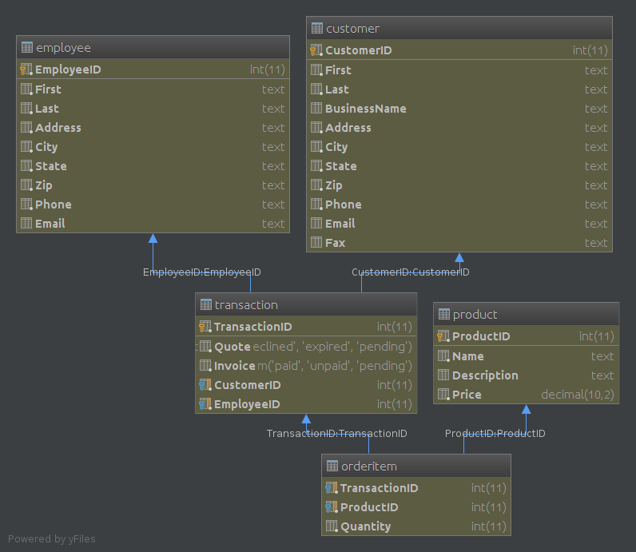

# DBapp

This is a point of sale program built for a friend. The program enables the user to graphically access and edit the bsuiness's transaction records.
### Features
  - Add Data
    - Products
    - Customers
    - Employees
  - Search Data
    - Transactions
    - Products
    - Customers
    - Employees
  - Update Transaction Records
  - Record a transactiom and all its information
  - Print (to a physical printer) receipts.
  
### Dataase Diagram

A transaction has a Quote and Invoice column. Those columns represent the state of the transaction.

A customer is first given a quote with the estimated cost, after which they have 30 days to accept that quote.
The business will give the customer an invoice and start gathering the products after the customer accepts the quote. The invoice must be paid within 30 days.

### Usage

Pre-compiled Jar: [Test][DemoJar]
   [DemoJar]: <Demo_Jar/DBapp.jar?raw=true>
